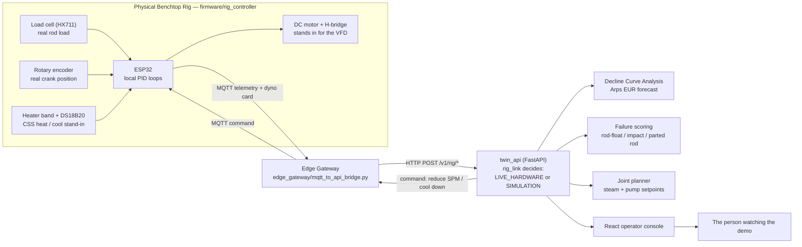
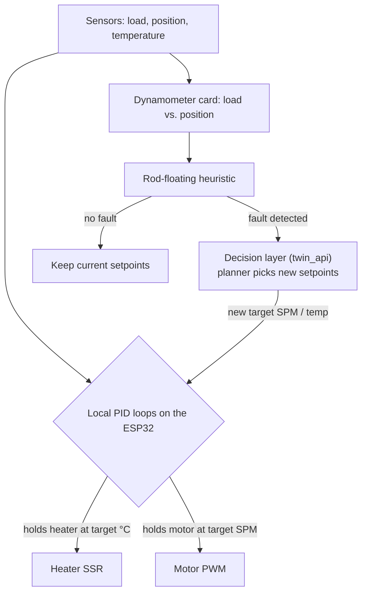

# 🛢️ DRAVA — Well-to-Surface Digital Twin with a Physical Rig (SIH26120)

**SIH26120 — AI-Enabled Well-to-Surface Digital Twin for Joint Optimization of Cyclic Steam Stimulation (CSS) and Sucker Rod Pump (SRP) Operations, Baghewala Heavy-Oil Field**  
*Oil India Limited (OIL) • Smart India Hackathon 2026*  
**Team**: MACH 2  
**Design Philosophy**: Physics First • Honest Data Labels • Live Hardware Over Simulation • Decision Support, Never Blind Automation

*drava (संचालक), Hindi: "the one who operates / drives" — because this project does not only watch a well, it drives one.*

[](https://sih.gov.in)
[](docs/problem-brief.md)
[](https://www.oil-india.com)
[](docs/domain-primer.md)
[](frontend/)
[](twin_api/)
[](gateway/)
[](firmware/rig_controller/)
[](docs/testing.md)

---

## 1. Problem Statement Context (SIH26120)

Baghewala is India's main onshore heavy-oil accumulation. The crude is 17–19° API and 1,500 to over 10,000 cP in a 46–48 °C reservoir, so it cannot flow on its own.

Operators inject high-pressure steam (**Cyclic Steam Stimulation**, CSS) to thin it, then lift it with a surface **sucker rod pump** (SRP). The two halves are managed separately, and that is where the losses come from:

* **Heat fades, oil thickens again**: over a 90–150 day cycle the rock hands its heat to the surrounding shale and viscosity climbs back from tens to thousands of cP.
* **Rods stop sinking**: at a fixed pump speed the rods can no longer fall as fast as the polished rod descends — *rod floating*, then shock loading, then a *parted rod* and a workover rig.
* **Reactive management**: stroke, speed and soak time are changed after production has already dropped or a rod has already broken.
* **High steam-oil ratio**: steam that does not reach productive rock is fuel and water wasted in a desert, and the biggest carbon source in the operation.

---

## 2. Integrated Solution Overview

**DRAVA** couples the reservoir's cooling to the pump's speed in one system:

1. **Physics twin**: first-principles models for reservoir heat balance (Marx-Langenheim style), crude viscosity (Walther / ASTM D341), a 1-D wellbore, and rod-pump mechanics (API RP 11L with Couette and valve drag) including a rod-float score and a dynamometer card.
2. **Hybrid ML on top**: a production forecaster (physics baseline + gradient-boosted residual), a four-hazard failure model, and an Isolation Forest anomaly detector.
3. **Joint planner**: a constrained grid search over steam volume, soak time, stroke length and speed, ranked by production, steam-oil ratio, energy and failure risk.
4. **Rule-based copilot**: routes an engineer's question to the right tools and quotes only tool output, so it cannot invent numbers.
5. **A physical benchtop rig (the differentiator)**: an ESP32 with a load cell, crank encoder, DS18B20 fluid sensor, heater and DC motor. Real rod load and speed flow into the same pipeline, and commands flow back to the motor.
6. **Live-versus-simulated switch**: every response says whether it came from `LIVE_HARDWARE` or `SIMULATION`, and simulated frames carry a watermark.

> ⚠️ **Scientific classification**: DRAVA is a **decision-support system**. Plans are recommendations for a production engineer to approve; nothing is sent to a real VFD automatically. Metrics are measured on **synthetic** data (see [docs/evaluation.md](docs/evaluation.md)).

---

## 3. What Actually Makes This Different



The **loop closes on both ends**: real sensors go up into the software, and commands come back down and change what the motor is physically doing. That return path — software commanding hardware, not only displaying a number — is what a pure simulation cannot show.

### Who controls what: PID governs the actuators, the AI layer governs the decisions



PID is deterministic and just holds a number steady. Reading the card ("is this rod floating?") and deciding how much to change speed are the analytic layer. Keeping that boundary honest is deliberate.

---

## 4. Workspace Layout

```
drava/
├── frontend/            ← React 19 + Vite + TypeScript operator console
│   └── src/
│       ├── views/       ← 19 screens and widgets (Overview, Autopilot, Digital twin, Decisions, Live ops, Copilot, tour…)
│       ├── lib/         ← API client, offline fallback, client-side physics port, field economics model
│       └── contracts/   ← Shared TypeScript types mirroring the API payloads
├── twin_api/            ← FastAPI inference service (:8000)
│   ├── main.py          ← Assembles the app from the routers
│   ├── routes/          ← status · fleet · estimates · scenarios
│   ├── payloads.py      ← Request bodies (Pydantic)
│   ├── instances.py     ← Shared model instances
│   ├── rig_link.py      ← LIVE_HARDWARE vs SIMULATION freshness switch
│   ├── learners/        ← rate_forecaster · failure_scorer · anomaly_watch
│   ├── planner/         ← plan_search (constrained Pareto grid search)
│   ├── synthetic/       ← synthetic_feed (correlated demo telemetry)
│   ├── artefacts/       ← Trained .joblib models + training_metrics.json
│   └── training.py      ← Dataset generation + model training pipeline
├── wellphysics/         ← First-principles physics (viscosity, reservoir_heat, wellbore, rod_pump, decline)
├── copilot/             ← Rule-based tool router (router.py)
├── gateway/             ← Spring Boot 3 gateway: REST proxy, STOMP broker, Flyway schema
├── firmware/rig_controller/  ← ESP32 firmware (PlatformIO): load cell, encoder, heater PID, motor PID, MQTT
├── edge_gateway/        ← MQTT → REST bridge between the rig and twin_api
├── deploy/              ← Dockerfiles (inference, gateway, console) and nginx.conf
├── datasets/            ← registry.yaml: data-source tiers and the honesty policy
├── params/              ← well.yaml: calibrated Baghewala field parameters
├── scripts/             ← check_all · retrain · demo_wells · start_local.ps1
├── tests/               ← 14 tests: physics, learners, decline curve
├── docs/                ← Technical dossier (architecture, models, API, schema, evaluation, Q&A…)
└── .github/workflows/   ← CI: console build, Python tests, Maven tests, Docker build check
```

---

## 5. Quick Start & Execution

Full instructions are in **[INSTALL.md](./INSTALL.md)**.

### Software stack (console + inference service)

```bash
python3 -m venv .venv && source .venv/bin/activate
pip install -r requirements.txt
python scripts/check_all.py              # 14/14 tests
```

**Terminal 1 — inference service**
```bash
uvicorn twin_api.main:app --host 127.0.0.1 --port 8000 --reload
```
* Swagger UI: [http://localhost:8000/docs](http://localhost:8000/docs)
* Status: [http://localhost:8000/v1/status](http://localhost:8000/v1/status)

**Terminal 2 — operator console**
```bash
cd frontend && npm install && npm run dev
```
Open the URL Vite prints (port 3000, or the next free one).

Without the rig connected, every endpoint falls back to the physics simulator, clearly tagged `SIMULATION`. Nothing breaks and nothing is mislabelled. If the API itself is unreachable, the console falls back to a client-side port of the same physics.

### Physical rig

```bash
# 1. Flash the ESP32 (PlatformIO)
cd firmware/rig_controller && pio run -t upload

# 2. Bridge the rig's MQTT stream into twin_api
cd edge_gateway && pip install -r requirements.txt && python mqtt_to_api_bridge.py

# 3. Confirm it is live
curl http://127.0.0.1:8000/v1/wells/BW-DEMO-001/data-mode
# {"well_id":"BW-DEMO-001","mode":"LIVE_HARDWARE","rig_last_seen_recently":true}
```

Once the rig is talking, every panel — dynamometer card, telemetry, decline curve — reads real numbers with no flag to flip; `rig_link.py` simply prefers fresh data (under 5 seconds old).

### Everything in Docker

```bash
docker compose up --build        # console :3000, gateway :8080, inference :8000, Postgres :5432
```

---

## 6. End-to-End Verification

```bash
python scripts/check_all.py          # 14 unit and integration tests
cd gateway && mvn test               # boots the Spring context, applies Flyway migrations
cd frontend && npm run build         # tsc -b + vite build
cd frontend && npm run lint          # oxlint
```

CI (`.github/workflows/ci-cd.yml`) runs all of the above plus a `/v1/status` smoke test and a Docker build check. Details: [docs/testing.md](docs/testing.md) and [docs/validation-status.md](docs/validation-status.md).

---

## 7. How the Pieces Communicate

1. **Telemetry**: the console asks `GET /v1/wells/{id}/telemetry`. If the rig published in the last 5 seconds, its measured load, speed, temperature and float flag are overlaid on a full frame tagged `LIVE_HARDWARE`; otherwise the simulator answers, tagged `SIMULATION`. The JSON shape is identical either way.
2. **Rig ingestion**: the ESP32 publishes to `drava/rig/BW-RIG-001/telemetry` and `.../dynocard` over MQTT; the edge gateway relays them to `POST /v1/rig/{id}/telemetry` and `.../dynocard`. Commands (`target_spm`, `target_temp_c`, `cool_down_demo`) travel the other way on `.../command`.
3. **Planning**: `POST /v1/plan/joint` runs the constrained search from the well's current cooling day; `POST /v1/assistant/ask` routes a question to the tools and returns an answer, the tools used, and the raw evidence.
4. **Gateway**: the Spring Boot service proxies well state, dynamometer cards, planning and copilot calls under `/gw/…`, returns clearly labelled fallback payloads if the inference service is down, and hosts a STOMP broker for live streaming.
5. **Soft degradation**: unreachable API → offline physics port in the browser; unreachable inference service → labelled fallback payloads from the gateway.

---

## 8. Models & Physics

| Layer | What it does | Where |
|---|---|---|
| Viscosity | Walther / ASTM D341 fit through 4,200 cP @ 47 °C, 145 cP @ 100 °C, 14.5 cP @ 200 °C, plus a Barus pressure term | `wellphysics/viscosity.py` |
| Reservoir heat | Heat injected → peak temperature after soak → exponential cool-down (conduction scaled by heated radius + convective term) | `wellphysics/reservoir_heat.py` |
| Wellbore | 1-D temperature/pressure/viscosity profile and Couette drag integral | `wellphysics/wellbore.py` |
| Rod pump | Kinematics, PPRL/MPRL, viscous + valve drag, float flag and risk, power, 40-point dyno card | `wellphysics/rod_pump.py` |
| Decline curve | Arps hyperbolic/exponential fit → EUR and time to economic limit | `wellphysics/decline.py` |
| Rate forecaster | min(pump capacity, Darcy inflow) + gradient-boosted residual, 1/7/30-day bands | `twin_api/learners/rate_forecaster.py` |
| Failure scorer | Rod float, impact, parted rod (Goodman), pump unseating; RF + GB blended 50/50 with physics; attribution table | `twin_api/learners/failure_scorer.py` |
| Anomaly watch | Isolation Forest on six signals + named rule findings | `twin_api/learners/anomaly_watch.py` |
| Planner | 216-candidate constrained grid, weighted 4-objective score, top-35 frontier + rejected samples with reasons | `twin_api/planner/plan_search.py` |

Measured on the project's synthetic dataset (3,500 rows): hybrid rate MAE 1.59 bbl/d, rod-float classifier ROC-AUC 0.953, parted-rod ROC-AUC 0.882, anomaly inlier coverage 96 %. These show the models learn the training signal — they are **not** field accuracy. See [docs/evaluation.md](docs/evaluation.md).

---

## 9. Embedded Hardware Subsystem (ESP32 Benchtop Rig)

* **Microcontroller**: ESP32 dev board, Arduino framework, PlatformIO (`firmware/rig_controller/platformio.ini`).
* **Sensors / actuators**

| Function | Part | Pin |
|---|---|---|
| Rod load | HX711 load-cell amplifier | DOUT 16, SCK 17 |
| Crank position | Rotary encoder (600 PPR) | A 18, B 19 |
| Fluid temperature | DS18B20 (1-Wire) | 4 |
| Heater band (steam stand-in) | SSR, PWM | 25 |
| Stroke motor (VFD stand-in) | H-bridge PWM + direction | 26, 27 |
| Status LEDs | Fault / Run | 2, 15 |

* **Control**: two PID loops on the ESP32 — heater holds fluid at a target (default 85 °C heating, 35 °C cooling floor); motor holds stroke speed at a target SPM (default 6.5).
* **Rod-float heuristic**: flags a flattened downstroke load swing combined with a slowed stroke period.
* **Demo trigger**: `{"cool_down_demo": true}` on the command topic drops the heater target so viscosity rises and rod floating shows up on the card within a few strokes.
* **MQTT contract**: `drava/rig/BW-RIG-001/{telemetry,dynocard,command}`, telemetry every 500 ms.

Full detail: [docs/hardware-rig.md](docs/hardware-rig.md).

---

## 10. Operator Console

| Sidebar item | What it shows |
|---|---|
| Overview | Field oil rate, value versus fixed speed, wells at risk, per-well phase / viscosity / speed / float-risk table |
| Autopilot | Control loop (Sense → Predict → Decide → Act), Autonomous or Advisory mode, decision log with undo |
| Digital twin | Wellbore schematic and 0–150 day time slider: temperature, viscosity, load and risk |
| Decisions | Trade-offs (Pareto), Pump speed, Steam cycle, What-if lab |
| Live operations | Failure watch (four hazards + attribution) and the dynamometer card analyzer |
| System tour | Five-step guided walkthrough |
| Copilot | Chat drawer with tool badges on each answer |

Field and Agents panels add a 12-well ranking with mini dyno-card shapes and a five-interlock check (PPRL, Goodman loading, gearbox torque, float risk, pump fillage).

---

## 11. Documentation Map

| Document | Contents |
|---|---|
| 📄 [SIH26120_PROJECT_REPORT.md](./SIH26120_PROJECT_REPORT.md) | Full technical submission report |
| [INSTALL.md](./INSTALL.md) | Setup on macOS / Linux / Windows, Docker, rig |
| [CHANGELOG.md](./CHANGELOG.md) | Versioned release notes |
| [PUSH_LOG.md](./PUSH_LOG.md) | What each push to the repository did |
| [V2_0_RESTRUCTURE_RUN_REPORT.md](./V2_0_RESTRUCTURE_RUN_REPORT.md) | Detailed report of the v2.0 rewrite and restructure |
| [docs/](./docs) | architecture, api-reference, schema, planning, models, evaluation, limits, Q&A, hardware, validation |

---

## 12. Data Honesty

* **Live mode**: every value tagged `LIVE_HARDWARE` was measured by the rig within the last 5 seconds (`rig_link.is_live()`).
* **Simulation mode**: every value tagged `SIMULATION` is produced by the physics models, calibrated to published Baghewala parameters, and carries the watermark *SIMULATED / SYNTHETIC - NOT OIL INDIA FIELD DATA*.
* **Fallback mode**: if the gateway cannot reach the inference service, its payloads say `FALLBACK_OFFLINE`.
* Nothing is ever shown as one when it is the other.

---

*DRAVA — Smart India Hackathon 2026 — Oil India Limited, Baghewala Field*  
*Team: MACH 2*
