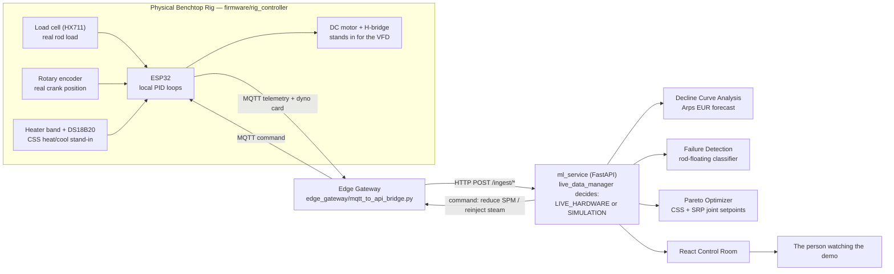
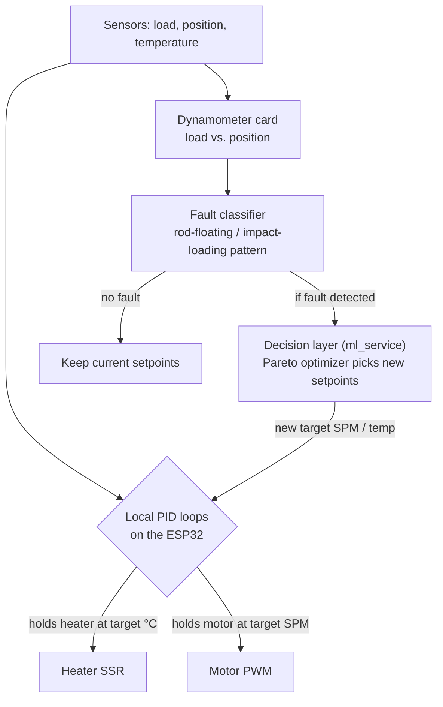

# 🛢️ Drava — A Digital Twin With an Actual Body

*drava (संचालक), Hindi: "the one who operates/drives" — because this project doesn't just watch a well, it drives one.*

[](https://sih.gov.in)
[](https://sih.gov.in)
[](https://www.oil-india.com)
[-green.svg?style=flat-square)]()
[]()
[](https://react.dev)
[](https://fastapi.tiangolo.com)
[-brightgreen.svg?style=flat-square)]()

---

## The one sentence that matters

Every other digital twin for this problem statement is a browser tab replaying a simulation. **This one drives a real motor, reads a real load cell, and produces a real dynamometer card from a physical rod that is actually moving right now.** Everything below explains how, but that sentence is the whole pitch.

---

## 📌 Problem Context: SIH26120

* **Organization:** Oil India Limited (OIL)
* **Category:** Software (we're adding the hardware nobody asked for, and nobody else built)
* **Theme:** Smart Automation / Oil & Gas Digitalization
* **Target Asset:** Baghewala Field Heavy Oil Wells, Jodhpur Sandstone Formation, Bikaner-Nagaur Basin, Rajasthan, India
* **Crude Characteristics:** Extra-heavy dead crude (17°–19° API), reservoir viscosity > 4,000 cP at native temperature (47°C), high asphaltic/wax content

### The dilemma, in plain terms

The oil at Baghewala is too thick to flow on its own. Operators inject high-pressure steam (**Cyclic Steam Stimulation**, CSS) to heat the reservoir and thin the crude, then a surface pump-jack (**Sucker Rod Pump**, SRP) lifts it. Over 90–120 days, that heat bleeds back out into the surrounding rock, the oil thickens again, and if the pump keeps running at a fixed speed, the rod can't sink fast enough through the thickening fluid on its downstroke. That's **rod floating**, followed by a shock impact when the rod finally catches up, which fatigues and eventually snaps rods. Right now, steam scheduling and pump speed are tuned separately, by experience, not together.

---

## 🧩 What actually makes this different



The **loop closes on both ends**: real sensors go up into the software, and real commands come back down and physically change what the motor is doing. That return path, software actually commanding hardware, not just displaying a number, is the piece a simulation can never show.

---

## 🎛️ Who controls what: PID governs the actuators, AI governs the decisions

This is the question a judge asks first, so it gets answered plainly instead of hand-waved:



PID is deterministic and doesn't need dressing up as AI, it just holds a number steady. The interpretation, "does this card shape mean rod floating," and the decision, "how much should stroke speed change," are the actual machine-learning surface. Keeping that boundary honest is deliberate.

---

## 🔬 Physics this project stands on

None of this is invented for the pitch. It's the same modeling lineage every real SRP/CSS optimization tool in the industry uses:

| Model | What it's for |
|---|---|
| **Walther / ASTM D341 viscosity equation** | How much the crude thins as it's heated, and thickens as it cools |
| **Marx-Langenheim thermal decay** | How fast the reservoir loses the steam's heat over the production window |
| **API RP 11L rod kinematics + Couette annular drag** | The load and velocity the rod actually experiences through a stroke, a practical engineering approximation of the fuller Gibbs wave-equation treatment of rod-string dynamics |
| **Arps Decline Curve Analysis** *(new in this build)* | Fits a hyperbolic/exponential decline to a rate history and forecasts Estimated Ultimate Recovery and time to economic limit, see `physics/decline_curve.py` |

The difference from a pure-simulation build: our rod kinematics and dynamometer card can be fed by `physics/srp_model.py`'s equations **or** by a real load cell and encoder on a real moving rod, the same math, validated against something you can put your hand on.

---

## 🚀 Quickstart

### Software stack (dashboard + ML + physics)

```bash
python3 -m venv .venv && source .venv/bin/activate
pip install -r ml_service/requirements.txt
python scripts/test_all.py          # 13/13 tests

# Terminal 1
uvicorn ml_service.main:app --host 127.0.0.1 --port 8000 --reload

# Terminal 2
cd frontend && npm install && npm run dev
# open http://localhost:5173
```

Without the rig connected, every endpoint falls back to the physics simulator automatically, clearly tagged `SIMULATION`, nothing breaks, nothing is misrepresented.

### Physical rig (the actual differentiator)

```bash
# 1. Flash the ESP32 (PlatformIO)
cd firmware/rig_controller
pio run -t upload

# 2. Bridge the rig's MQTT stream into ml_service
cd edge_gateway
pip install -r requirements.txt
python mqtt_to_api_bridge.py

# 3. Confirm it's live
curl http://127.0.0.1:8000/api/wells/BW-DEMO-001/data-mode
# {"mode": "LIVE_HARDWARE", "rig_last_seen_recently": true}
```

Once the rig is talking, every dashboard panel, dyno card, telemetry, decline curve, is reading real numbers, no code change, no flag to flip, `live_data_manager.py` just prefers freshness.

---

## 📂 Repository Layout

```text
mach2/
├── firmware/rig_controller/     # ESP32: load cell, encoder, heater PID, motor PID, MQTT telemetry
│   ├── platformio.ini
│   ├── include/{pins,config,pid}.h
│   └── src/main.cpp
├── edge_gateway/                 # Bridges the rig's MQTT stream into ml_service's REST ingestion
│   └── mqtt_to_api_bridge.py
├── physics/                      # First-principles petroleum physics
│   ├── viscosity_model.py        # Walther / ASTM D341
│   ├── thermal_model.py          # Marx-Langenheim
│   ├── wellbore_model.py         # 1D wellbore discretization
│   ├── srp_model.py              # API RP 11L kinematics, Couette drag, dyno card synthesis
│   └── decline_curve.py          # Arps DCA: EUR + time-to-economic-limit
├── ml_service/                   # FastAPI: predictions, optimization, live/sim data switch
│   ├── main.py
│   ├── live_data_manager.py      # LIVE_HARDWARE vs SIMULATION freshness switch
│   ├── models/ · optimizer/ · simulator/
├── agent/                        # Agentic copilot (tool-calling supervisor)
├── frontend/                     # React 19 + Vite + Tailwind control room
├── backend/springboot/           # Enterprise gateway (optional, Docker profile)
├── tests/                        # 13 tests: physics, ML service, decline curve
├── config/physics.yaml           # Calibrated Baghewala field parameters
└── docs/                         # Technical dossier
```

---

## 🌐 Key API Endpoints

| Method | Endpoint | Description |
| :--- | :--- | :--- |
| `GET` | `/api/wells/{well_id}/telemetry` | Live-hardware-first telemetry (falls back to simulator) |
| `GET` | `/api/wells/{well_id}/data-mode` | Is this well reporting from the rig or the simulator, right now |
| `POST` | `/ingest/telemetry/{well_id}` | Edge gateway → ml_service hardware ingestion |
| `POST` | `/ingest/dynocard/{well_id}` | Edge gateway → ml_service dyno card ingestion |
| `GET` | `/api/wells/{well_id}/srp/dyno-card` | Dynamometer card, live rig points if fresh, else synthesized |
| `POST` | `/predict/decline-curve` | Arps DCA on any rate history you supply |
| `GET` | `/api/wells/{well_id}/decline-curve` | DCA on this well's own history, live stroke log if available |
| `POST` | `/predict/failure` | Rod-floating / impact-loading risk |
| `POST` | `/optimize/joint` | Pareto-optimal CSS + SRP operating point |
| `POST` | `/agent/query` | Natural-language copilot over the well's state |
| `WS` | `/ws/telemetry/{well_id}` | Live streaming telemetry |

---

## 🎯 The demo that a simulation can't do

1. Show the rig idle, dynamometer card healthy, fluid warm.
2. Trigger the cooling demo (`cool_down_demo: true` over MQTT, or a button in the UI).
3. Watch the fluid actually cool, the load cell's readings actually distort, and the fault classifier actually flag it, on stage, in real time.
4. Watch the optimizer drop the target SPM, and watch the physical motor actually slow down.
5. Ask the copilot why, and get an answer grounded in the reading that just happened, not a canned response.

No other team presenting this problem statement can do step 3 or step 4 with real hardware. That's the whole game.

---

## 🛡️ Data Honesty

* **Live mode:** every number tagged `LIVE_HARDWARE` came from the physical rig within the last few seconds, checked by `live_data_manager.is_live()`.
* **Simulation mode:** every number tagged `SIMULATION` is generated by the physics models in `physics/`, calibrated to published Baghewala field parameters, used only when the rig isn't connected.
* Nothing is ever shown as one when it's the other. That switch is the point.

---

## 👥 Made by Team MACH 2
# drava
