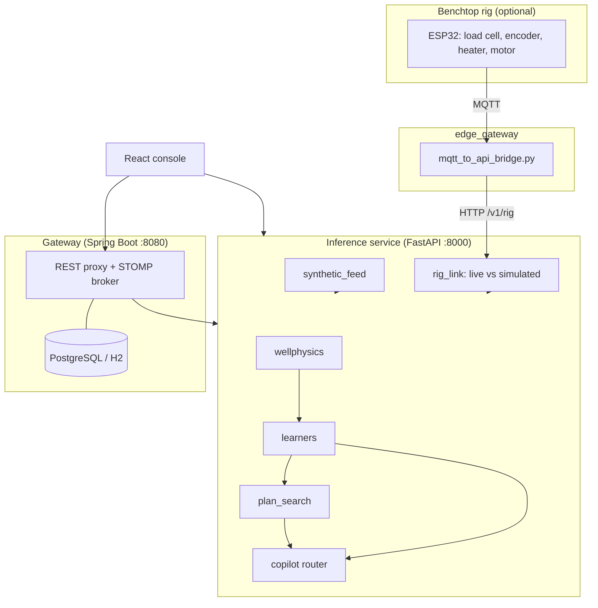

#  DRAVA — COMPREHENSIVE TECHNICAL PROJECT REPORT
## AI-Enabled Well-to-Surface Digital Twin for Joint CSS + SRP Optimization, Baghewala Heavy-Oil Field

```
========================================================================================
PROJECT IDENTITY & METADATA
========================================================================================
Hackathon:            Smart India Hackathon 2026 (SIH 2026)
Problem Statement ID: SIH26120
Theme:                Oil & Gas · Smart Automation · Industrial Digitalization
Category:             Software with a physical hardware extension
Organization:         Oil India Limited (OIL)
Field:                Baghewala, Bikaner-Nagaur Basin, Rajasthan (Jodhpur Sandstone)
Team:                 MACH 2
System Version:       v2.0.0
Date of Submission:   September 2026
Repository:           github.com/TejasKadam001/drava-sih2026
Verified Status:      14/14 Python tests · Spring context + Flyway boot · 0 TypeScript errors
                      · old-vs-new regression comparison identical (physics, ML, planner, API)
========================================================================================
```

---

## Table of Contents
1. [Executive Summary](#1-executive-summary)
2. [Problem Statement Analysis (SIH26120)](#2-problem-statement-analysis-sih26120)
3. [Method & the Four Integrity Rules](#3-method--the-four-integrity-rules)
4. [End-to-End System Architecture](#4-end-to-end-system-architecture)
5. [Physics Models](#5-physics-models)
6. [Machine-Learning Layer](#6-machine-learning-layer)
7. [Joint Optimisation Engine](#7-joint-optimisation-engine)
8. [Copilot (Tool-Routing Assistant)](#8-copilot-tool-routing-assistant)
9. [Operator Console](#9-operator-console)
10. [Hardware Rig & Live-Data Path](#10-hardware-rig--live-data-path)
11. [Backend Services, API & Database](#11-backend-services-api--database)
12. [Verification, Testing & Validation Results](#12-verification-testing--validation-results)
13. [Parts List & Economic Assumptions](#13-parts-list--economic-assumptions)
14. [Technology Stack](#14-technology-stack)
15. [Limitations & Roadmap](#15-limitations--roadmap)
16. [Conclusion](#16-conclusion)

---

## 1. Executive Summary

Baghewala's crude is 17–19° API and thousands of centipoise at the 46–48 °C reservoir temperature, so Oil India injects steam (Cyclic Steam Stimulation, CSS) to thin it and lifts it with sucker rod pumps (SRP). Over a 90–150 day cycle the reservoir cools, viscosity climbs from tens to thousands of cP, and a pump speed that was safe on day 10 makes the rods float and slam on day 90 — ending in a parted rod and a workover. Steam scheduling and pump speed are normally set by different teams, after the fact.

**DRAVA** is a well-to-surface digital twin that links the two. It consists of:

1. **A physics twin** (`wellphysics/`): reservoir heat balance, Walther viscosity, a 1-D wellbore and a rod-pump model with rod-float scoring and a synthetic dynamometer card.
2. **A hybrid ML layer** (`twin_api/learners/`): production forecaster, four-hazard failure scorer and anomaly detector.
3. **A joint planner** (`twin_api/planner/`): a constrained search over steam volume, soak time, stroke and speed, ranked on four objectives.
4. **A rule-based copilot** (`copilot/`): routes questions to tools and quotes only tool output.
5. **An operator console** (`frontend/`): React + TypeScript with autopilot, digital twin, trade-off, failure and dynamometer views.
6. **A physical benchtop rig** (`firmware/`, `edge_gateway/`): an ESP32 with load cell, crank encoder, fluid sensor, heater and motor whose real measurements replace simulated ones, and which accepts commands back.
7. **A Spring Boot gateway** (`gateway/`): REST proxy with graceful fallbacks, STOMP broker and a Flyway-managed relational schema.

Every telemetry response states its source — `LIVE_HARDWARE`, `SIMULATION` or `FALLBACK_OFFLINE` — and simulated frames carry the watermark *SIMULATED / SYNTHETIC - NOT OIL INDIA FIELD DATA*.

---

## 2. Problem Statement Analysis (SIH26120)

### 2.1 What the problem asks for
1. Monitoring and predictive intelligence for CSS and SRP.
2. Reservoir heating and cool-down prediction.
3. Multi-step production forecasting.
4. Pump settings that avoid rod floating and impact loading.
5. Steam volume and soak optimisation to reduce SOR and energy.
6. Early warnings for rod fatigue and pump unseating.
7. A decision-support interface for engineers and asset managers.

### 2.2 The physical dilemma
| Item | Baghewala |
|---|---|
| Formation / depth | Jodhpur Sandstone, 900–1,100 m |
| Crude | 17–19 °API; 1,500–10,000+ cP at 46 °C; 12–18 cP at 200 °C |
| Reservoir | 46–48 °C, depleted (about 45–65 bar), porosity about 26 %, permeability about 850 mD |
| Natural inflow | under 2 bbl/day at native viscosity — not economic |
| CSS effect | viscosity drops about 280× after steam; first weeks flow at 80–220 bbl/day |
| Late-cycle problem | as rock cools, drag on the rods rises until they no longer sink freely |

### 2.3 Failure chain the system watches
1. **Rod floating** — viscous drag on the downstroke exceeds what gravity can overcome.
2. **Impact loading** — the unit reverses and strikes the lagging string.
3. **Parted rod** — cyclic stress breaks a rod at a coupling; production stops until a rig pulls the string.
4. **Pump unseating** — friction and suction surges lift the pump off its seat.

### 2.4 Why joint optimisation
A fixed 8 SPM is fine when viscosity is 40 cP and floats the rods when it is 3,000 cP. Cutting the soak short can leave near-well fluid hot enough to gas-lock the pump. The thermal state must drive pump speed, and withdrawal pattern must inform when to steam again.

---

## 3. Method & the Four Integrity Rules

1. **Honest labels.** Simulated values are never presented as field data. Every response reports its `data_source_mode`; simulated frames are watermarked (`datasets/registry.yaml` holds the policy and the three data tiers: public benchmarks, calibrated simulator, field adapters).
2. **Physics first, ML for the residual.** Predictions are `f_physics + g_ML`. Physics enforces heat balance, Darcy flow and pump mechanics; ML learns what physics leaves over. If an artefact is missing, each model falls back to physics-only or Ridge so the service still starts.
3. **Advice, not autonomy.** Plans are recommendations for a production engineer; nothing is sent to a real VFD automatically. The autopilot view has an Advisory mode and a decision log with undo.
4. **Say only what was measured.** Metrics come from `scripts/retrain.py` on a synthetic dataset and are labelled that way. An earlier draft's unmeasured benchmark table was removed. The optimizer is called a grid search because it is one.

---

## 4. End-to-End System Architecture



| Part | Path | Port | Role |
|---|---|---|---|
| Console | `frontend/` | 3000 | operator UI, with client-side physics fallback |
| Inference service | `twin_api/` | 8000 | physics, ML, planner, copilot, ingestion |
| Gateway | `gateway/` | 8080 | REST proxy with fallbacks, STOMP broker, Flyway schema |
| Database | `gateway/.../db/migration` | 5432 | 19 tables, PostgreSQL / TimescaleDB or in-memory H2 |
| Rig | `firmware/rig_controller` | — | real load, speed, temperature; PID actuators |
| Bridge | `edge_gateway/` | — | MQTT ↔ REST |

**Telemetry flow.** `GET /v1/wells/{id}/telemetry` builds a full simulated frame; if the rig published within 5 seconds, its measured load, speed, temperature and float flag are overlaid and the frame is tagged `LIVE_HARDWARE`. The JSON shape never changes, so the console does not need to know the source.

---

## 5. Physics Models

### 5.1 Crude viscosity — `wellphysics/viscosity.py`
Walther / ASTM D341: `log10(log10(ν + 0.7)) = A − B·log10(T_K)` with A = 8.924, B = 3.315, then `μ = ν·ρ`, with density corrected for thermal expansion and a Barus term `exp(0.0025·ΔP)` above 55 bar. Calibrated to about 4,200 cP at 47 °C, 145 cP at 100 °C and 14.5 cP at 200 °C.

### 5.2 Reservoir heat — `wellphysics/reservoir_heat.py`
- Heat injected: `Q = m·[c_w(T_steam − T_native) + x·L_v]` with x = 0.78, L_v = 1,420 kJ/kg, T_steam = 295 °C.
- Retained after soak: `Q·η·exp(−0.012·t_soak)`, η = 0.72.
- The heated cylinder is sized to warm by 75 % of the steam-to-native gap (radius capped at 45 m); peak temperature is clamped to native + 15 °C … steam − 25 °C.
- Cool-down: `T(t) = T_native + (T_peak − T_native)·exp(−(λ_cond + λ_conv·q)·t)` with λ_cond = 0.0135/day scaled by `sqrt(11.8 / R_heated)`, λ_conv = 0.00008 per bbl/day, q defaulting to 90 bbl/day.

### 5.3 Wellbore — `wellphysics/wellbore.py`
Depth-discretised nodes (default 10 segments over 950 m) with temperature `T_amb + (T_bh − T_amb)·frac^0.65`, linear pressure, local viscosity and density, a pump-zone flag, and a Couette drag integral over the string.

### 5.4 Rod pump — `wellphysics/rod_pump.py`
- Kinematics: ω = 2πN/60, v_max = Sω/2, a_max = Sω²/2.
- Loads: `PPRL = W_rf + W_fluid + inertia + drag`, `MPRL = W_rf − inertia − drag`.
- Drag: annular Couette shear `2πμ v H / ln(r_tubing / r_rod)` plus Hagen-Poiseuille valve throttling `8μ L v / r²` acting on 65 % of the plunger area.
- Rod floating: sinker bars pull with 30 % of buoyant string weight; `velocity ratio = v_max / v_terminal`; **float flag** if ratio ≥ 0.80 or sinking margin < 200 lbf; **risk** is a logistic curve centred on 0.75, clamped to 1–99 %; impact risk = 1.12 × float risk (capped at 1).
- Also: displacement, viscosity-reduced pump efficiency (floor 0.55), electrical power at 82 % motor efficiency, kWh/bbl, gearbox torque and a 40-point surface/downhole dynamometer card (floating wells show a sagging trough and an end-of-stroke spike).

### 5.5 Decline curve — `wellphysics/decline.py`
Arps hyperbolic (with exponential as the b→0 limit) fitted by `scipy.optimize.curve_fit`; returns EUR and time to the economic limit, and reports insufficient data explicitly.

---

## 6. Machine-Learning Layer

Trained by `twin_api/training.py` on 3,500 physics-consistent synthetic records (seed 42, 80/20 split); artefacts live in `twin_api/artefacts/`.

| Model | Type | Inputs | Output |
|---|---|---|---|
| Rate forecaster | physics baseline `min(pump lift, Darcy inflow)` + GradientBoostingRegressor residual | temperature, viscosity, SPM, stroke, day, lags, inflow, pump capacity | t+1, t+7, t+30 day rate with ±5 %, ±8 %, ±14 % bands |
| Failure scorer | physics risks blended 50/50 with RandomForest (float) and GradientBoosting (parted rod) | temperature, viscosity, SPM, stroke, day | four hazard probabilities, health score, loads, attribution table |
| Anomaly watch | IsolationForest (150 trees, contamination 0.04) + rules | temp, pressure, PPRL, MPRL, rate, power | verdict, score, named findings, severity |

**Measured on the synthetic set** (`twin_api/artefacts/training_metrics.json`):

| Metric | Value |
|---|---|
| Residual MAE / RMSE / 5-fold CV MAE | 1.59 / 2.25 / 1.61 bbl/d |
| Hybrid rate MAE / R² | 1.59 bbl/d / 0.9996 |
| Rod-float classifier accuracy / F1 / ROC-AUC | 0.990 / 0.720 / 0.953 |
| Parted-rod classifier accuracy / F1 / ROC-AUC | 0.993 / 0.286 / 0.882 |
| Anomaly inlier coverage | 96.0 % |

These show the models learn their training signal. The hybrid R² is near 1 because physics already explains most of the synthetic rate; parted-rod events are rare, so F1 is low. They are **not** field accuracy (see §15).

---

## 7. Joint Optimisation Engine

`twin_api/planner/plan_search.py` enumerates 4 steam volumes (1,800–3,000 t) × 3 soak times (4, 6, 8 d) × 3 strokes (2.0, 2.4, 2.8 m) × 6 speeds (3.5–8.5 SPM) = **216 candidates**, evaluating each through the thermal, viscosity and pump models at the well's real cycle day (never earlier than day 40, because rod float is a cold-reservoir, late-cycle failure).

**Rejected if:** SPM > 9.5 or < 2.0; stroke > 3.0 m; PPRL > 22,000 lbf; rod-float risk > 40 %; soak < 2 days.

**Scored** by a weighted sum of four normalised terms — production, SOR, energy, risk (defaults 0.40 / 0.25 / 0.15 / 0.20, overridable). The response returns the best plan, expected percentage changes versus today, constraint verification, the top-35 frontier, five sample rejected plans with reasons, and an engineer-approval disclaimer.

---

## 8. Copilot (Tool-Routing Assistant)

`copilot/router.py` maps keywords to tool chains — recommend/plan → failure + optimiser + constraints; risk/failure → failure + attribution; forecast/production → forecaster; otherwise a well summary. Fourteen named tools (`get_well_state`, `predict_failure`, `optimize_operations`, `check_constraints`, `generate_report`, …) return real numbers; the answer is a template around them. Each reply carries `answer`, `tools_used` and `evidence_data`, so any figure is traceable. It is **not** an LLM and cannot fabricate values.

---

## 9. Operator Console

| Area | Content |
|---|---|
| Overview | Field oil rate, value versus fixed speed, wells at risk, per-well phase/viscosity/speed/float-risk table |
| Autopilot | Sense → Predict → Decide → Act loop; Autonomous or Advisory; decision log with undo |
| Digital twin | Wellbore schematic and 0–150 day time slider |
| Decisions | Trade-offs (Pareto scatter with selectable candidates and rejected plans), Pump speed, Steam cycle, What-if lab |
| Live operations | Failure watch (four hazard cards + attribution) and dynamometer card analyzer |
| Field / Agents | 12-well ranking with mini dyno-card shapes; five interlocks (PPRL, Goodman loading, gearbox torque, float risk, pump fillage) |
| Tour and Copilot | Five-step walkthrough; chat drawer with tool badges |

A client-side port of the physics (`frontend/src/lib/physics.ts`) matches the backend step for step, so the console stays usable and consistent when the API is unreachable.

---

## 10. Hardware Rig & Live-Data Path

### 10.1 Rig
| Function | Part | Pin |
|---|---|---|
| Rod load | HX711 amplifier + load cell | DOUT 16, SCK 17 |
| Crank position | Rotary encoder, 600 PPR | A 18, B 19 |
| Fluid temperature | DS18B20 (1-Wire) | 4 |
| Steam-heating stand-in | Heater band via SSR (PWM) | 25 |
| VFD stand-in | DC motor via H-bridge | PWM 26, DIR 27 |
| Status | Fault / Run LEDs | 2, 15 |

Two PID loops run on the ESP32 — heater (default target 85 °C, cooling floor 35 °C) and motor (default 6.5 SPM, PWM 40–220). A heuristic flags a flattened downstroke load swing with a slow stroke period. Telemetry publishes every 500 ms.

### 10.2 Message contract
Topics `drava/rig/BW-RIG-001/{telemetry,dynocard,command}`. Telemetry fields: `rig_id`, `source`, `timestamp_ms`, `load_n`, `fluid_temp_c`, `spm_actual`, `spm_target`, `heater_phase`, `rod_floating_detected`. Commands: `target_spm`, `target_temp_c`, `cool_down_demo`.

### 10.3 Live switch
`twin_api/rig_link.py` keeps the latest telemetry and dyno card per well with timestamps; `is_live()` is true for 5 seconds after the last message. It also stores a stroke log (bounded to 20,000 entries) that feeds decline analysis when at least 30 strokes exist.

### 10.4 Demo sequence
1. Rig warm, card healthy. 2. Publish `{"cool_down_demo": true}`. 3. Viscosity rises; the load swing flattens and the float flag appears. 4. The planner recommends a lower SPM; a `target_spm` command slows the motor. 5. Ask the copilot why.

---

## 11. Backend Services, API & Database

### 11.1 Inference API (excerpt; full list in [docs/api-reference.md](docs/api-reference.md))
| Method | Path | Purpose |
|---|---|---|
| GET | `/v1/status`, `/v1/models` | health, model catalogue |
| GET | `/v1/wells`, `/v1/wells/{id}/telemetry`, `/state`, `/data-mode`, `/production`, `/css`, `/srp`, `/srp/dyno-card`, `/decline-curve` | wells and telemetry |
| POST | `/v1/rig/{id}/telemetry`, `/v1/rig/{id}/dynocard` | rig ingestion |
| POST | `/v1/forecast/rate`, `/v1/forecast/decline` | forecasts |
| POST | `/v1/risk/failure`, `/v1/risk/anomaly` | risk |
| POST | `/v1/fluid/viscosity`, `/v1/reservoir/temperature` | physics lookups |
| POST | `/v1/sim/steam`, `/v1/sim/pump`, `/v1/sim/scenario` | simulation |
| POST | `/v1/plan/joint` | joint optimisation |
| POST | `/v1/assistant/ask` | copilot |
| WS | `/v1/stream/{id}` | frame every 2 seconds |

### 11.2 Gateway
`/gw/wells/{id}/state`, `/gw/wells/{id}/srp/dyno-card`, `/gw/plan/run`, `/gw/assistant/query`. `InferenceClient` wraps each upstream call in one guarded helper and returns a labelled fallback (`FALLBACK_OFFLINE`, `FALLBACK_MODE`, `FAILED_OR_FALLBACK`) on failure. `StompBrokerSetup` exposes `/ws-stomp` (SockJS) and `/ws-native`, with `/topic` broadcasts and `/app` inbound.

### 11.3 Database
Flyway `V1__init_schema.sql` builds 19 tables in six groups — access control (`roles`, `users`, `audit_logs`), asset registry (`reservoirs`, `wells`, `well_completion`), operations (`telemetry`, `production_history`, `srp_operations`, `failure_events`), steam cycles (`css_cycles`, `steam_injection`), ML registry (`model_versions`, `predictions`, `anomalies`) and planning (`scenarios`, `optimization_runs`, `recommendations`, `agent_sessions`) — with named constraints and lookup indexes. `V2__seed_data.sql` loads roles, demo users, the Baghewala reservoir, three wells and the model registry. Recommendations store an `approval_status` (default `PENDING_REVIEW`) so an engineer's decision can be recorded. See [docs/schema.md](docs/schema.md).

---

## 12. Verification, Testing & Validation Results

| Layer | Check | Result |
|---|---|---|
| Physics and ML | `python scripts/check_all.py` — 5 physics, 6 learner/planner/copilot, 3 decline-curve tests | 14 / 14 pass |
| Gateway | `mvn test` — boots the Spring context, Flyway applies V1 and V2 | pass |
| Frontend | `tsc -b`, `vite build`, `oxlint` | clean |
| CI | console build, Python suite + `/v1/status` smoke test, Maven tests, Docker build check | defined in `.github/workflows/ci-cd.yml` |
| Regression | old build vs new build on the same inputs | identical outputs across physics (about 500 points), ML models (1,225), planner and simulator, copilot, client-side physics, and 38 API calls with routes mapped |
| Manual | every console screen against the live backend; rig ingest flips `data-mode` to `LIVE_HARDWARE` | no console errors |

Tests assert physical invariants (direction of change, bounds), not stored numbers, so retraining does not break them. Not yet verified: Docker Compose end to end, the firmware and bridge on real hardware, and any real Oil India data. See [docs/validation-status.md](docs/validation-status.md).

---

## 13. Parts List & Economic Assumptions

### 13.1 Rig parts (prices not recorded)
ESP32 dev board · HX711 + load cell · 600 PPR rotary encoder · DS18B20 probe · heater band + SSR · DC motor + H-bridge driver · fluid reservoir · 2 LEDs · MQTT broker (a laptop or Raspberry Pi).

### 13.2 Assumptions used by the console's value model (`frontend/src/lib/fieldModel.ts`)
These are stated on screen as assumptions, not measurements.

| Assumption | Value |
|---|---|
| Oil price | US$70/bbl at ₹84/US$ (₹5,880/bbl) |
| Steam cost | ₹2,600 per ton (fuel + water treatment) |
| Rod-part workover | ₹15,00,000 including deferred oil |
| Failure window | rod-float risk read as probability of a rod part within 30 days |
| Deferred production | 14 days waiting for a rig |

Value = oil revenue − amortised steam cost − expected failure cost, summed over the 150-day cycle. Changing these constants changes the ₹ figures shown; the physics does not depend on them.

---

## 14. Technology Stack

| Layer | Technology |
|---|---|
| Console | React 19, TypeScript, Vite, Recharts, lucide-react, oxlint |
| Inference | Python 3, FastAPI, Uvicorn, Pydantic, NumPy, SciPy, scikit-learn, joblib |
| Gateway | Java 21, Spring Boot 3.3, Spring WebSocket/STOMP, Flyway, springdoc, H2 / PostgreSQL |
| Firmware | ESP32, Arduino framework, PlatformIO, HX711, Encoder, DallasTemperature, ArduinoJson, PubSubClient |
| Bridge | paho-mqtt, requests |
| Delivery | Docker, Docker Compose, nginx, GitHub Actions, Render, Vercel |

---

## 15. Limitations & Roadmap

### 15.1 Limitations
1. **Not a full-field simulator.** One well, semi-analytical heat balance, 1-D wellbore.
2. **Simulated field data.** No Oil India SCADA feed is available; the demo runs on a calibrated simulator and says so.
3. **One real data source, and it is a bench rig,** not field equipment.
4. **Synthetic training labels.** ML metrics come from physics-generated data.
5. **Rule-based copilot.** Keyword routing, not a language model.
6. **Decision support only.** No automatic VFD dispatch.
7. **Adapters unproven.** CSV, REST, MQTT and PostgreSQL adapters are specified but untested on real feeds.
8. **Input checks not implemented.** Timestamp, range, spike and frozen-sensor checks are planned, not built.

### 15.2 Roadmap
- Benchmark the forecaster and failure scorer on independent or field data.
- Implement the input-quality checks and a persisted audit trail behind the recommendation workflow.
- Exercise Docker Compose and the Postgres path in CI.
- Add a wave-equation rod model (Gibbs) alongside the API RP 11L approximation.
- Test the rig against a longer cool-down and record the resulting cards as a small real dataset.

---

## 16. Conclusion

DRAVA treats the reservoir and the pump as one system: as the rock cools, the safe pump speed falls, and the plan for the next steam cycle changes with it. It runs on calibrated physics with a learned correction, says plainly which numbers are measured and which are simulated, and keeps a human in the decision loop. Its distinguishing feature is a physical rig whose real load-cell readings and commands flow through the same pipeline as the simulator — the one thing a pure simulation cannot show.

*DRAVA — Smart India Hackathon 2026 — Oil India Limited · Team MACH 2*
