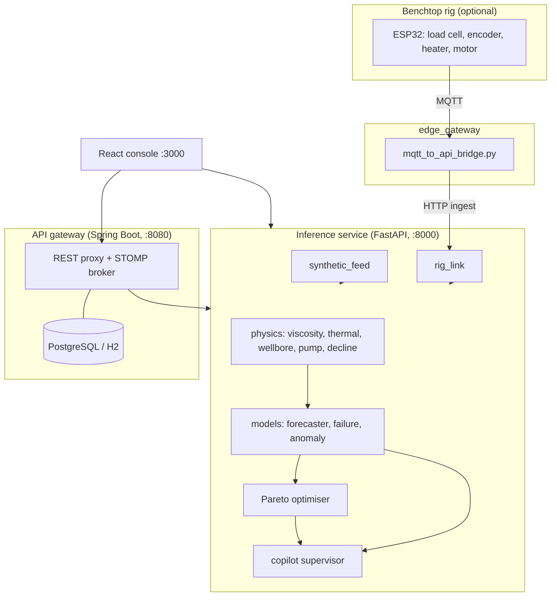

# System architecture

Drava is a decision-support system that couples what happens in the reservoir (steam heat, viscosity) with what happens at surface (rod pump loads). It has four runtime parts plus an optional hardware rig.

## Components

### Operator console - `frontend/`
React 19, TypeScript and Vite, with Recharts for plots and Lucide icons. Views: overview, digital twin with a time slider, dynamometer card, failure intelligence, joint optimiser, scenario lab, field and agents panels, and the copilot drawer.

### Inference service - `twin_api/`
FastAPI app assembled in `main.py` from routers in `twin_api/routes/` (`status`, `fleet`, `estimates`, `scenarios`). Request bodies are in `payloads.py`; model instances are created once in `instances.py`. Physics lives in `wellphysics/`, trained artefacts in `twin_api/artefacts/`, and the copilot in `copilot/`. Endpoint list: `api-reference.md`.

### API gateway - `gateway/`
Java 21 / Spring Boot 3. `InferenceClient` proxies well state, dynamometer cards, optimisation and copilot queries to the inference service and returns a labelled fallback when it is unreachable. `StompBrokerSetup` exposes STOMP over SockJS (`/ws-stomp`) and a raw WebSocket (`/ws-native`). Flyway builds the schema described in `schema.md`.

### Hardware path - `firmware/`, `edge_gateway/`
An ESP32 measures rod load, crank position and fluid temperature and drives a motor and heater. The gateway script relays MQTT messages to the ingest endpoints and relays commands back.

## Telemetry and honesty

Each telemetry request goes to the live rig first. If it published recently, its measured values are placed into a full frame tagged `LIVE_HARDWARE`; otherwise the simulator answers and the frame is tagged `SIMULATION` and watermarked "SIMULATED / SYNTHETIC - NOT OIL INDIA FIELD DATA". The simulator couples its signals physically: steam raises temperature, viscosity falls, rate rises; then cooling raises viscosity, drag and rod-float risk.

Field adapters for CSV, PostgreSQL, REST and MQTT are specified in `datasets/registry.yaml` and will be used once Oil India data access is authorised.
