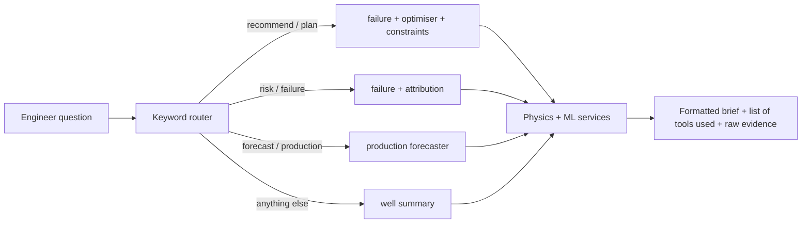

# Copilot (tool-routing assistant)

The copilot lives in `copilot/router.py`. It is **rule-based**: it reads a question, decides which physics and ML tools to run, and formats their output. It does not call a language model and cannot make a number up, because every figure in an answer comes from a tool result.

## Tools

| Tool | Returns |
| --- | --- |
| `get_well_state` | live thermal, fluid, production and pump state |
| `get_historical_production` | daily production and load log |
| `get_css_history` | past steam cycles, soak times, SOR |
| `get_srp_history` | pump hardware facts and rod-failure history |
| `predict_production` | hybrid forecast with confidence bands |
| `predict_failure` | rod-float, impact, parted-rod and unseating risk |
| `predict_temperature` | reservoir temperature on a given day |
| `simulate_css` | peak temperature for a steam job |
| `simulate_srp` | loads, power and float risk for a pump setting |
| `run_scenario` | what-if across steam and pump |
| `optimize_operations` | Pareto search seeded with the well's state |
| `check_constraints` | feasibility of a plan and the limits it breaks |
| `get_model_explanation` | feature attribution behind the failure score |
| `generate_report` | one-well diagnostic brief |

## Response shape

Every answer returns `answer` (markdown), `tools_used` (the tools that ran, in order) and `evidence_data` (the raw results), so a reviewer can trace each figure.

## Guardrails

- **No invented numbers.** Text is templated around tool output.
- **Advice only.** Plans are recommendations; a field engineer approves any setpoint change.
- **Constrained plans.** The optimiser drops any candidate that breaks a mechanical or process limit before ranking.
